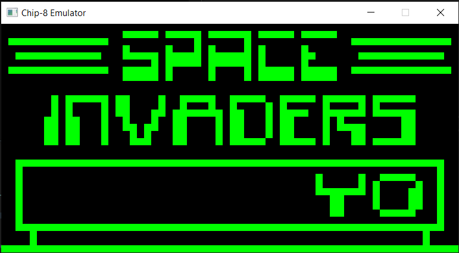

# Chip-8 Emulator in C++

This is a minimal Chip-8 emulator implemented in C++. It represents my first attempt at emulation, providing a valuable learning experience in low-level operations and bitwise manipulation for logical decisions. The emulator simulates the Chip-8 virtual machine, capable of running Chip-8 programs and games. It's a simple and educational project aimed at understanding the fundamentals of computer emulation.

## Features

- Chip-8 instruction set emulation.
- Basic graphics and input handling.
- Basic Audio
- Educational project for learning low-level programming concepts.
- Built with C++ and SFML using Visual Studio.

## Highlights

This project provided insights into:

- Bitwise operations for logical decisions.
- Low-level operations involved in emulating a virtual machine.
- Chip-8 architecture and instruction set.
